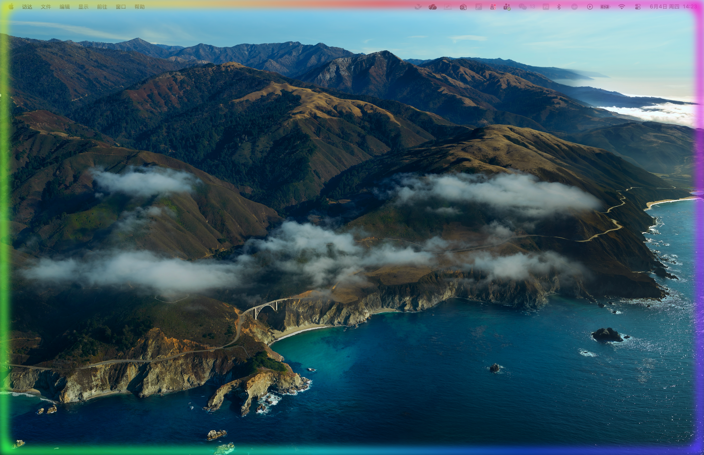

# Halo

Agent 任务完成时，屏幕边缘亮起一圈发光，几秒后自动消失。



Halo 是一个极小的原生命令行工具，用来给 AI 编程代理（Claude Code、Codex CLI 等）做"任务完成"的视觉提醒。当代理跑完一轮长任务，你可能正在看别的窗口、刷网页或者发呆——Halo 会让整个屏幕边缘亮起来，像 iPhone 上 Siri 那种边缘光环，提醒你"可以回来了"。

它不是常驻后台的监控程序。它就是一个被调用一次、亮几秒、然后自己退出的小程序。"什么时候算任务完成"这件事，交给代理工具自带的钩子机制去判断，Halo 只负责"亮"。

## 为什么这样设计

监控一个 AI 代理"什么时候完成"看似要写复杂的进程监控，其实不用。Claude Code 和 Codex CLI 都内置了生命周期钩子：任务一结束，工具自己就会调用你指定的命令。所以整套方案拆成两个干净的部分：

- Halo 本身——一个"被调用 → 边缘发光 → 退出"的命令行二进制，完全不知道也不关心是谁在调它。
- 钩子配置——两行配置，把 Halo 挂到代理工具的完成事件上。

零进程监控，零轮询。Halo 对外就是个普通 CLI 程序，任何能在任务结束时执行命令的工具都能驱动它。

## 设计原则：每平台原生，接口统一

Halo 不用跨平台框架（如 Qt、Electron）。那类方案打包动辄几十 MB。Halo 在每个平台用该平台最原生的技术栈各自实现一份，换来极小的体积和最贴近系统的观感：

- macOS：Swift + Cocoa + Core Animation
- Windows：C/C++ + Win32 + Direct2D（规划中）

不同平台是不同语言、不同代码，但它们对外暴露**完全一致的命令行接口**。这意味着一份钩子配置（路径不同除外）在任何平台上行为相同。这个接口约定写在 [docs/cli-spec.md](docs/cli-spec.md)，是把多个原生实现绑在一起的"契约"。

## 平台支持

| 平台 | 状态 | 技术栈 | 文档 |
|---|---|---|---|
| macOS | ✅ 可用 | Swift / Cocoa / Core Animation | [docs/macos.md](docs/macos.md) |
| Windows | 🧪 已实现（待验证） | C++ / Win32 / DirectComposition / Direct2D | [docs/windows.md](docs/windows.md) |
| Linux | 💭 待定 | C/C++ / X11 或 Wayland | — |

## 快速上手（macOS）

仓库在 `dist/macos/Halo.app` 直接提供了预编译产物（约 90 K），克隆后即可用，无需安装 Swift 工具链：

```bash
./dist/macos/Halo.app/Contents/MacOS/halo --duration 3 --style rainbow
```

想自行编译：

```bash
cd src/macos
chmod +x build.sh
./build.sh
```

脚本会把 `Halo.app` 重新编译到 `dist/macos/`。

屏幕边缘应亮起彩色流光 3 秒后淡出，期间鼠标点击照常穿透到下面的窗口。完整的编译、参数、原理和排错见 [docs/macos.md](docs/macos.md)。

## 命令行用法

```
halo [--duration <秒>] [--style <rainbow|pulse>] [--color <#RRGGBB>]
```

| 参数 | 说明 | 默认 |
|---|---|---|
| `--duration` | 发光持续秒数 | `3` |
| `--style` | `rainbow`（彩色流光）或 `pulse`（单色呼吸） | `rainbow` |
| `--color` | `pulse` 模式的颜色，十六进制 | `#3B82F6` |

不认识的参数会被忽略，因此 Codex 在调用时附带的 JSON 负载不会导致出错。完整定义见 [docs/cli-spec.md](docs/cli-spec.md)。

## 接入 AI 代理

把命令里的路径换成你本机编译产物的绝对路径。

Claude Code —— 编辑 `~/.claude/settings.json`：

```json
{
  "hooks": {
    "Stop": [
      { "matcher": "*", "hooks": [
        { "type": "command", "command": "/绝对路径/halo/dist/macos/Halo.app/Contents/MacOS/halo --duration 3 --style rainbow" }
      ]}
    ]
  }
}
```

Codex CLI —— 编辑 `~/.codex/config.toml`（`notify` 是根键，必须放在所有 `[表]` 之前）：

```toml
notify = ["/绝对路径/halo/dist/macos/Halo.app/Contents/MacOS/halo", "--duration", "3", "--style", "rainbow"]

[tui]
notifications = true
```

可直接复制的配置见 [examples/](examples/)。

## 仓库结构

```
halo/
├── README.md                 本文档：项目介绍
├── docs/
│   ├── macos.md              macOS 方案（编译、原理、排错）
│   ├── windows.md            Windows 方案（规划中）
│   └── cli-spec.md           命令行接口契约（跨平台一致性的依据）
├── src/                      各平台原生实现源码
│   ├── macos/                macOS 实现（Swift）
│   │   ├── halo.swift
│   │   └── build.sh
│   ├── windows/              Windows 实现（C++ / Direct2D）
│   │   ├── halo.cpp
│   │   └── build.bat
│   └── linux/                Linux 实现（待定）
├── dist/                     预编译产物，开箱即用
│   ├── macos/
│   │   └── Halo.app/         macOS 应用包（约 90 K）
│   └── windows/
│       └── halo.exe          Windows 可执行（在 Windows 上 build.bat 后生成）
└── examples/                 可直接复制的钩子配置
    ├── claude-code.settings.json
    └── codex.config.toml
```

## 许可证

见 [LICENSE](LICENSE)。
